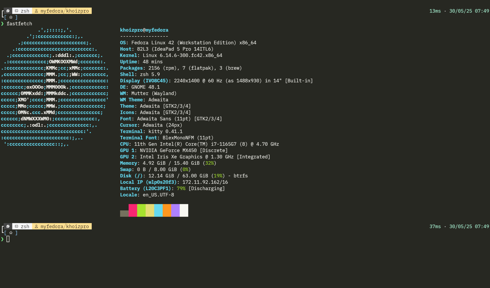
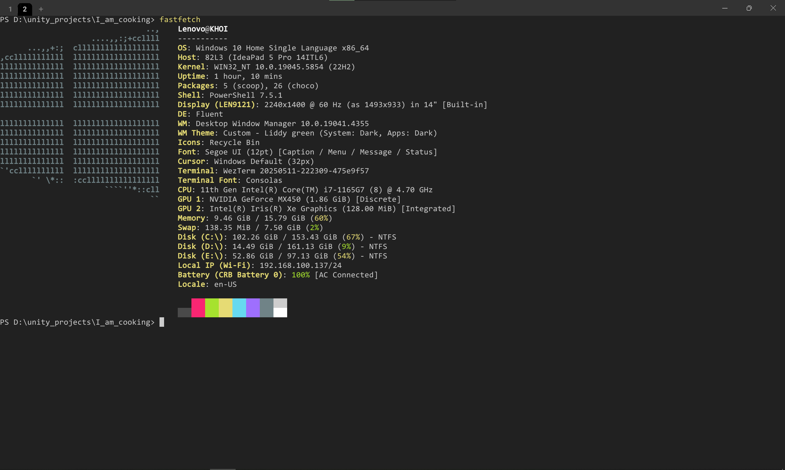

# Neovim Config

**Super fast** Neovim configuration that starts up in **50 ms or less**!.

- Window 10: Wezterm + Powershell7
- Fedora Linux: Kitty + Zsh

---

## Specs
- Speed: Starts up blazingly fast (≤50 ms).
- Look: Classic Monokai theme. (https://github.com/khoido2003/classic_monokai.nvim)
- Tools: Manages plugins with LazyVim and LSP servers with Mason.nvim.


## Keymappings

### Window Navigation
| Key         | Action             |
|-------------|--------------------|
| `Ctrl + h`  | Move to left pane  |
| `Ctrl + j`  | Move to down pane  |
| `Ctrl + k`  | Move to up pane    |
| `Ctrl + l`  | Move to right pane |

### Editing
| Key         | Action                |
|-------------|-----------------------|
| `Ctrl + s`  | Save file             |
| `Ctrl + z`  | Undo                  |
| `Ctrl + c`  | Copy to clipboard     |
| `Ctrl + v`  | Paste from clipboard  |
| `Ctrl + a`  | Select all text       |
| `Del`       | Delete (visual mode)  |
| `Alt + j`   | Move line down        |
| `Alt + k`   | Move line up          |
| `Ctrl + /`  | Toggle comment        |

### Search and Navigation
| Key         | Action                     |
|-------------|----------------------------|
| `Leader + f` | Start search              |
| `Leader + ff`| Find files (Telescope)    |
| `Alt + f`   | Live grep (Telescope)     |
| `Alt + Shift + f` | Fuzzy find in buffer |
| `Tab`       | Next buffer               |
| `Shift + Tab` | Previous buffer         |
| `Up`/`Down` | Navigate wrapped lines    |
| `Enter`     | Select current line       |

### File Explorer
| Key         | Action                |
|-------------|-----------------------|
| `Leader + e`| Toggle NvimTree       |

### LSP (Language Server Protocol)
| Key         | Action                  |
|-------------|-------------------------|
| `Leader + gd`| Go to definition       |
| `Leader + gr`| Go to references       |
| `Leader + gt`| Go to type definition  |
| `Leader + rn`| Rename symbol          |
| `Leader + k` | Hover documentation    |
| `Leader + sh`| Signature help         |
| `Leader + ca`| Code action            |
| `Leader + d` | Show diagnostics (float)|

### Git (via Gitsigns)
| Key         | Action                  |
|-------------|-------------------------|
| `Leader + nh`| Next hunk              |
| `Leader + ph`| Previous hunk          |
| `Leader + rh`| Reset hunk             |
| `Leader + rb`| Reset buffer           |
| `Leader + df`| Show diff              |
| `Leader + bl`| Blame line             |
| `Leader + gs`| Toggle Git signs       |

### Diffview
| Key         | Action                  |
|-------------|-------------------------|
| `Leader + do`| Open Diffview          |
| `Leader + dc`| Close Diffview         |
| `Leader + dr`| Refresh Diffview       |
| `Leader + dh`| File history (all)     |
| `Leader + dhf`| File history (current)|

### Terminal
| Key         | Action                  |
|-------------|-------------------------|
| `Ctrl + t`  | Toggle terminal         |


## Prequesites

- Autoformat code with Conform.nvim: https://github.com/stevearc/conform.nvim

    + To have Conform.nvim auto format for each programming language, on local machine
    need to dowload the relevant formatter or use Mason

    + For example: JS/TS -> Prettier

- LSP server will be dowloaded automatically by Mason.nvim


## Nerd font
Recommend dowload FiraCode for better font and syntax support

Dowload: https://github.com/tonsky/FiraCode


### Dowload dependencies on Fedora(Linux)
```
sudo dnf install -y gcc gcc-c++ make pkgconf-pkg-config \
    libtool automake autoconf git curl unzip \
    ninja-build cmake python3 python3-neovim
```

### telescope-fzf-native.nvim on Windows

#### 1. Install required tools (one time)

```powershell
# Run in PowerShell as Administrator
winget install Kitware.CMake
winget install Ninja-build.Ninja
scoop install rg fd

```

#### 2. Install Visual Studio Build Tools (C++)

- Download: https://visualstudio.microsoft.com/visual-cpp-build-tools/
- Run installer → select "Desktop development with C++"
- Install (~2.5 GB)
- Restart PC

#### 3. Install VC++ Redistributables (BOTH!)

- x64: https://aka.ms/vs/17/release/vc_redist.x64.exe
- x86: https://aka.ms/vs/17/release/vc_redist.x86.exe

#### 4. First-time build

Start Menu → type → "x64 Native Tools Command Prompt for VS 2022" → Open
Paste these commands:

```cmd
cd %LOCALAPPDATA%\nvim-data\lazy\telescope-fzf-native.nvim
rmdir /s /q build
cmake -S. -Bbuild -G Ninja -DCMAKE_BUILD_TYPE=Release
cmake --build build --config Release
cmake --install build --prefix build
```

#### 4. Verify
```
:checkhealth telescope


telescope:                                                                  ✅

Checking for required plugins ~
- ✅ OK plenary installed.
- ✅ OK nvim-treesitter installed.

Checking external dependencies ~
- ✅ OK rg: found ripgrep 14.1.1 (rev 4649aa9700)
- ✅ OK fd: found fd 10.2.0

===== Installed extensions ===== ~

Telescope Extension: `fzf` ~
- ✅ OK lib working as expected
- ✅ OK file_sorter correctly configured
- ✅ OK generic_sorter correctly configured

Telescope Extension: `live_grep_args` ~
- No healthcheck provided
```

### Dowload Zig as compiler for Nvim-Tree-sitter(Window)
Using chocolatey

```
choco install zig
```
or visit Zig website for more guide: https://ziglang.org/learn/getting-started/#direct

### Install Lazygit to use Git in terminal

Window
```
choco install lazygit
```

Fedora
```
sudo dnf copr enable atim/lazygit -y
sudo dnf install lazygit
```


### Win32Yank(Window)

This is important to enable copy and paste inside Neovim on Window since it does not support it
Dowload: https://github.com/equalsraf/win32yank/releases


## Requirements

- Neovim >= 0.11.0 

- Git >= 2.19.0 

- Nerd Font(v3.0 or greater) (optional, but needed to display some icons)

- lazygit (optional)

## Results






