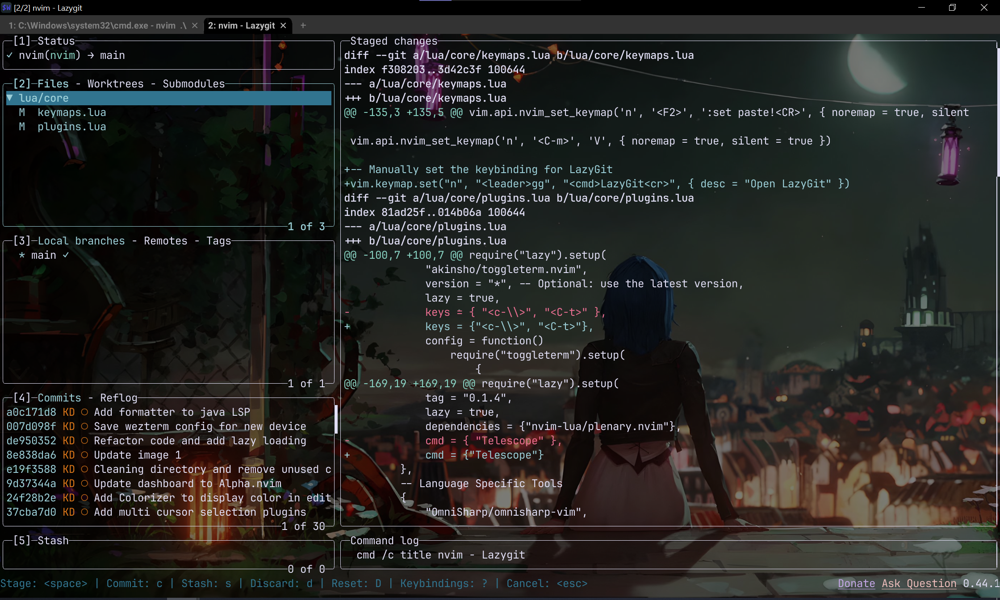
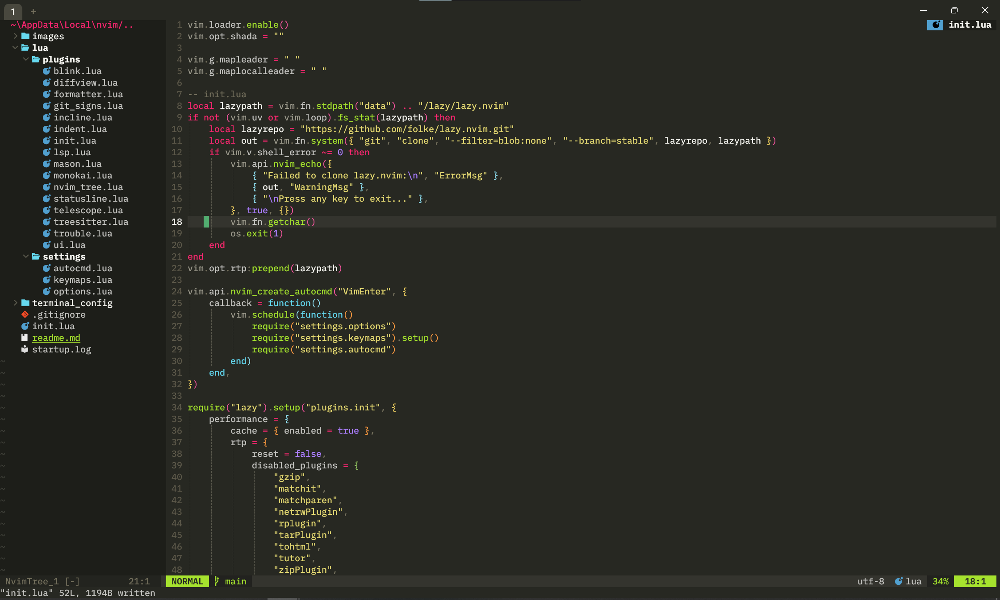
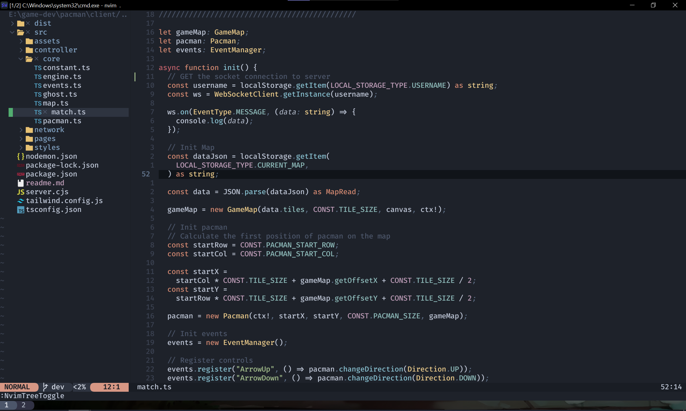
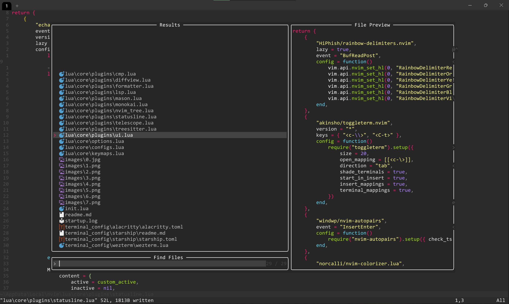
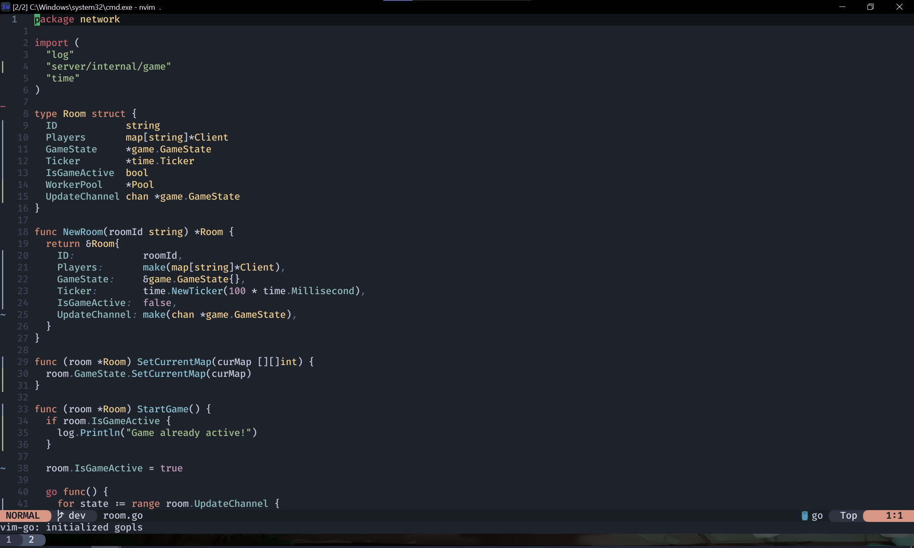
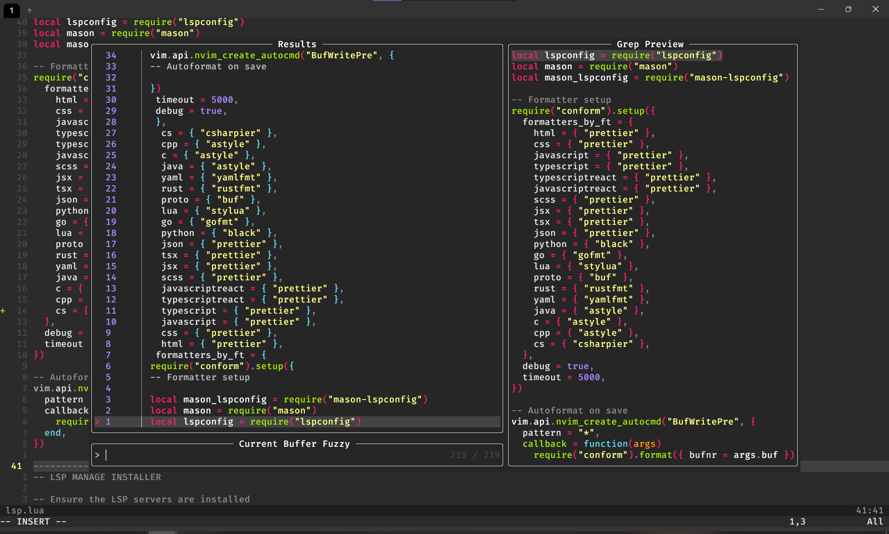
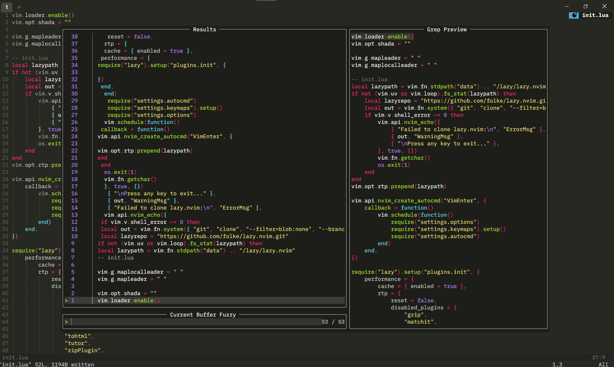

# Neovim Config

## How to use this repo (Guide for Window user)
Clone this repo to nvim folder
bash
```
C:\Users\Your-Name\AppData\Local\nvim
```

If using Wezterm terminal, paste the wezterm folder to .config folder
bash
```
C:\Users\Your-Name\.config
```

## Overview

This configuration will make Neonvim become a full-fledged IDE like VS Code

Theme: Nordic(https://github.com/AlexvZyl/nordic.nvim)

Support: C#, JS/TS, Go, Rust, Java, HTML/CSS, Python, Java, yaml, Dockerfile

## Tools

This Neovim configuration will use LazyVim to manage all Neovim plugins and Mason to control the LSP server

## Prerequesites

Below is some dependencies needed to make sure all the code reccommendation and linting work for some specific language

### GUI: Neovide

Written in Rust so it is super fast and have some built in features with icon support
Dowload: https://neovide.dev/

### Using built in terminal

I am currently using Wezterm as my terminal and it is amazing, you should try it
out

Recommend dowload FiraCode for better font and syntax support

Dowload: https://github.com/tonsky/FiraCode

### If using Window, dowload Zig as compiler for Nvim-Tree-sitter since C have some problem when compile

Using chocolatey
bash

```
choco install zig
```
or visit Zig website for more guide: https://ziglang.org/learn/getting-started/#direct

### Install Lazygit to use Git in terminal

On Window
bash
```
choco install lazygit
```




### Add diff to global varibles(Require to use proto format)

Add this to the edit global varible
bash
```
C:\Program Files\Git\usr\bin
```
### LSP for Rust

Step 1: Dowload MinGW-w64 and add it to the global path
Step 2: Configure Rust to use MinGW 
bash 
```
rustup install stable-x86_64-pc-windows-gnu

rustup default stable-x86_64-pc-windows-gnu

rustc --version --verbose

```

Step 3: Dowload rust-analyzer for the LSP
bash
```
rustup component add rust-analyzer
```

NOTE: Default Rust will use MSVC instead of MinGW-w64 so in order to use that
you have to install Visual Studio Installer and install MSVC from there

### Install buf for proto file format
bash
```
scoop install buf
```

### Win32Yank: Only on Window

This is important to enable copy and paste inside Neovim since it does not support it
Dowload: https://github.com/equalsraf/win32yank/releases

### LSP for C# and .NET:

Dowload Omnisharp and Visual Studio Build Tools

Omnisharp: https://github.com/OmniSharp/omnisharp-roslyn/releases/

Visual Studio Build Tools: https://visualstudio.microsoft.com/downloads/

New Update: since the omnisharp support is so horrible so I will use another approach which is using the C# dev kit Roslyn from Vs code as the LSP server so I will use "seblj/roslyn.nvim", this will execute the extension from vs code to do the LSP

Find the Roslyn, something similar to this: C:/Users/Lenovo/.vscode/extensions/ms-dotnettools.csharp-2.55.29-win32-x64/.roslyn/Microsoft.CodeAnalysis.LanguageServer.dll

### LSP for HTML, CSS

Using adminstrator access in CMD or Powershell to dowload by Nodejs:

- Language server
  bash

```
npm install -g vscode-langservers-extracted
```

- Prettier
  bash

```
npm install -g prettier
```

### LSP for Javascript/Typescript

bash

```
npm install -g typescript typescript-language-server


npm install -g eslint

```

### LSP for Java

Require using JDTLS but currently I can not set it up for some reason, will try to fix it in the future

UPDATE:
Dowload jdtls from this: https://download.eclipse.org/jdtls/snapshots/?d  

After dowload, extract it to a folder then find the /bin and add it to the global environment variables

Check if jdtls in cmd:
bash
```
jdtls --version
```
NOTE: without jdtls, the LSP can not work so make sure this have to be installed
and added to the global variables.

Add formatter for java:

Dowload it here and put the path to the formatter in lsp.lua:
https://github.com/google/google-java-format/releases


### LSP for TailwindCSS

Open cmd and install tailwind server to global
bash

```
npm install -g @tailwindcss/language-server
```

### Tabnine AI

On Window, require dowload pswh - Powershell 7

Dowload here: https://github.com/PowerShell/PowerShell/releases/tag/v7.4.6

Then follow the guide from official Tabnine github: https://github.com/codota/tabnine-nvim

## Requirements

Neovim >= 0.9.0 (needs to be built with LuaJIT)

Git >= 2.19.0 (for partial clones support)

a Nerd Font(v3.0 or greater) (optional, but needed to display some icons)
lazygit (optional)

## Results














